# 19 Categories of Animals

+ Arapaima

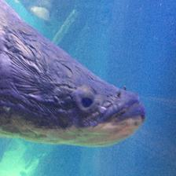

+ Orange Revabborre

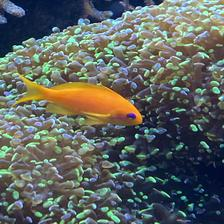

+ Stingray

+ Toco Toucan

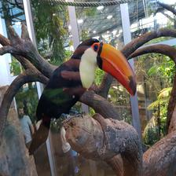

+ Emerald Toucanet

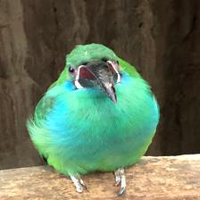

+ Pied Tamarin

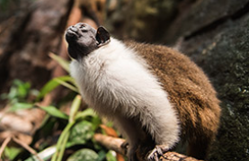

+ Sunbittern

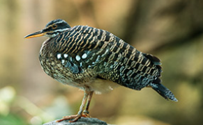

+ Goldbelly Damsel

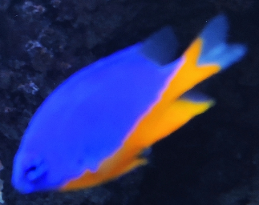

+ Lemon Damsel

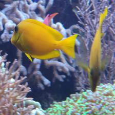

+ Red Ibis

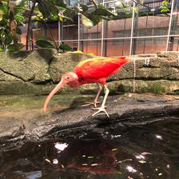

+ Thornback Ray

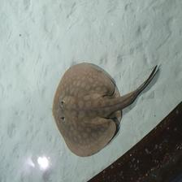

+ Picked dogfish

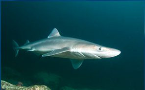

+ Clownfish

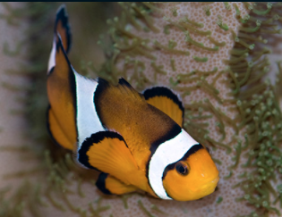

+ Common dragonet

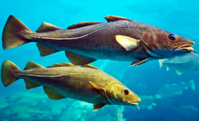

+ Starfish

+ Indian Surgeonfish

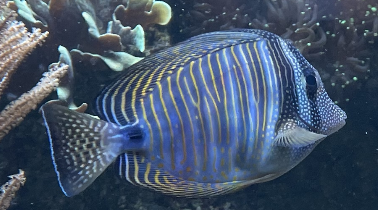

+ Yellowfin surgeonfish

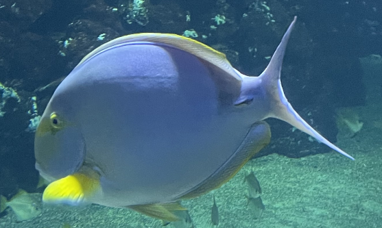

+ Silver Moony

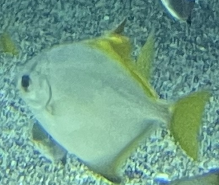

+ Blue Fish

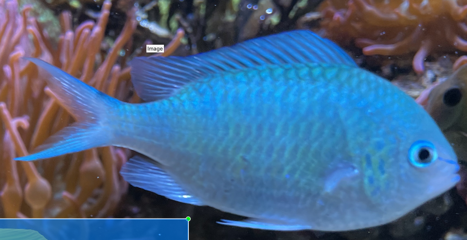

